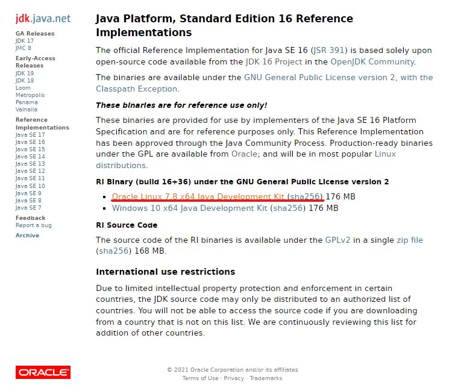
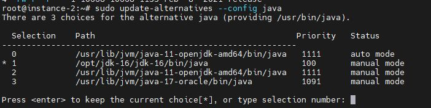
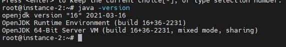

# How To Install Java 16 On Ubumtu / Debian

1.Download File ( [Java JDK 16 or Java SE 16](https://jdk.java.net/) )

  



  

2. Extracts the downloaded to `/opt/jdk-16` 

  

```
[ Input ]

$ sudo mkdir /opt/jdk-16
$ sudo tar -zxf *NameFileDownloadJava16*.tar.gz -C /opt/jdk-16
$ ls -lsa /opt/jdk-16

[ Output ]

ls -lsa /opt/jdk-16
total 36
4 drwxr-xr-x  8 root  root  4096 Dec 27 08:49 .
4 drwxr-xr-x  3 root  root  4096 Dec 27 08:49 ..
4 drwxr-xr-x  2 root  root  4096 Dec 27 08:49 bin
4 drwxr-xr-x  5 root  root  4096 Dec 27 08:49 conf
4 drwxr-xr-x  3 root  root  4096 Dec 27 08:49 include
4 drwxr-xr-x  2 root  root  4096 Dec 27 08:49 jmods
4 drwxr-xr-x 69 root  root  4096 Dec 27 08:49 legal
4 drwxr-xr-x  5 root  root  4096 Dec 27 08:49 lib
4 -rw-r--r--  1 10668 10668 1133 Feb  8  2021 release

```

  

3.This `update-alternatives --install /usr/bin/java java` let the Ubuntu know there is one more option `/opt/jdk-16/bin/java` for the `/etc/alternatives/java` link.

  

```
$ sudo update-alternatives --install /usr/bin/java java /opt/jdk-16/bin/java 100

```

  

  

4.Update the `/etc/alternatives/java` link.

The below result shows 5 JDK installed on this Ubuntu; choose option 2 for the above extracted JDK 16 `/opt/jdk-16/bin/java`.

  

```
$ sudo update-alternatives --config java
```

  

  

  

  

5.Done.

  


